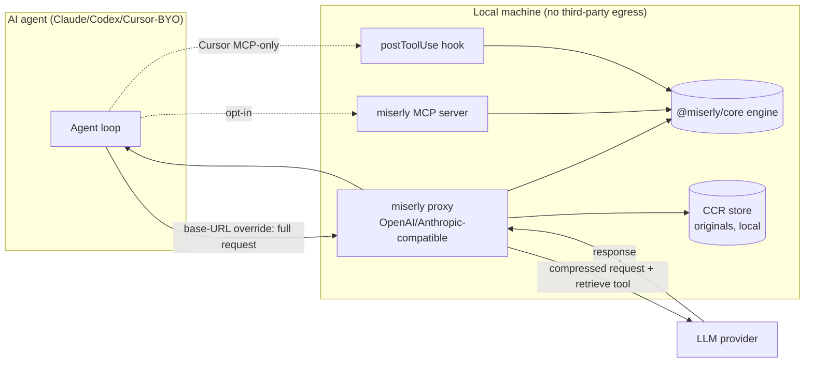

# miserly × AI Agents — Context Optimization via Local Proxy, MCP & Hooks

**Status:** Design / feasibility (no implementation yet)
**Targets:** Claude Code, Codex, Aider (proxy) · Cursor (proxy w/ caveats + MCP/hooks)
**Last updated:** 2026-06-29

---

## 1. TL;DR

We want miserly to **compress the context that flows into an LLM** while you code — so a 4,000-line log or a giant JSON blob becomes a tight summary *before* it consumes model tokens, while you keep the untouched original.

There are **three** places to intercept, and they are not equally powerful:

| Interception point | What it can do | Power |
| --- | --- | --- |
| **API proxy** (override the agent's LLM base URL) | Rewrite the **entire outbound request** — system prompt, full history, and *every* tool output, regardless of source | ★★★ Strongest, tool- & editor-agnostic |
| **MCP server** (explicit tool) | Compress on demand when the agent calls `miserly.optimize`; in Cursor a `postToolUse` hook can also replace **MCP** tool output | ★★ Medium, opt-in |
| **Editor hooks** (Cursor/Claude) | Observe / block; inject extra context (Claude only); **cannot** rewrite the prompt; Cursor can only *replace* MCP tool output | ★ Weak |

**Decision (updated):** Build miserly as a **local proxy** first — that is the architecture the leading OSS tool in this space ([Headroom](#9-prior-art-headroom)) uses, and it's the only path that lets us compress *everything* the model reads. MCP is a useful **opt-in** companion; editor hooks are a weak fallback.

**Important Cursor caveat:** the proxy is cleanest for agents that honor a base-URL env var (Claude Code: `ANTHROPIC_BASE_URL`, Codex/Aider: `OPENAI_BASE_URL`). Cursor only reroutes traffic when you use its **"Override OpenAI Base URL" + your own key** mode; its default *managed* models route through Cursor's servers and can't be redirected to a local proxy. So for stock Cursor, the MCP/hook paths still matter. (Verify against current Cursor behavior before committing.)

---

## 2. Motivation

LLM coding sessions burn tokens mostly on **tool results**, not on what you type: file reads, `grep`/search dumps, terminal output, and tool/MCP responses get spliced into the model's context window verbatim. That costs money (input tokens) and crowds the window, pushing out more useful information and degrading answers.

miserly already does the hard part — classify content, plan a pipeline, and compress with measurable token reduction (see `src/engine`). Today it only runs in the browser studio. The goal is to put that engine **inline in the agent loop**, locally, with the original always preserved.

Privacy is a feature: the engine runs **locally**, so routing context through miserly shrinks what's sent to the model rather than shipping your data to a third party.

---

## 3. The three interception points

### 3.1 API proxy (primary) — override the base URL

A local server speaks the provider's API (OpenAI- and/or Anthropic-compatible). You point the agent at it; it rewrites the request body and forwards it on:

```
Agent (Claude/Codex/Cursor-BYO)
  │  full request: system + history + ALL tool outputs
  ▼
http://localhost:8787   ← miserly proxy (compress request, inject retrieve tool)
  ▼
real provider (Anthropic / OpenAI)
```

- It sees the **whole payload**, so it can compress *any* content — built-in `Read`/`Shell`/`Grep` output included — with no "MCP-only" restriction.
- It's **editor-agnostic** (same proxy works across agents).
- The "hooks can't rewrite the prompt" limit doesn't apply, because this isn't a hook.
- Wiring: `ANTHROPIC_BASE_URL=http://localhost:8787 claude` (Claude Code), `OPENAI_BASE_URL=http://localhost:8787/v1` (Codex/Aider), or Cursor's *Override OpenAI Base URL* (BYO key only — see §1 caveat).

### 3.2 MCP server (secondary, opt-in)

Expose miserly as an MCP tool the agent calls deliberately (e.g. `miserly.optimize`). In Cursor, a `postToolUse` hook can additionally **replace** an MCP tool's output via `updated_mcp_tool_output` (this works *only* for MCP tools — built-in tools can only be appended to via `additional_context`).

### 3.3 Editor hooks (weak fallback)

Configured in `hooks.json`; scripts exchange JSON over stdin/stdout (exit `0` ok, `2` block, `failClosed` to block on error). What they **can't** do is the crux:

- **Cursor** `beforeSubmitPrompt`: validate/block only — a returned modified prompt is silently dropped.
- **Claude Code** `UserPromptSubmit`: *"cannot replace the prompt; it only injects `additionalContext` alongside it."* (`additionalContext` is delivered as a model-only system reminder, not a chat bubble.)
- The only rewrite powers are on **tool calls**: Cursor `preToolUse.updated_input` / `postToolUse.updated_mcp_tool_output` (MCP-only); Claude `PreToolUse.updatedInput` / `PostToolUse.updatedToolOutput` (any tool).

> **Governance note:** Enabling an MCP server (or any external endpoint) in this environment is approval-gated (Runlayer-managed). This doc designs *miserly's own* components; registering/enabling them must follow the org's MCP approval flow — not ad-hoc `npx` installs.

---

## 4. The miserly engine is already portable

Feasibility hinges on running the engine outside the browser. Verified:

- `src/engine/**` has **no browser dependencies** (no `window`/`document`/`localStorage`/`import.meta.env`/DOM).
- It exposes a clean, framework-agnostic API via `src/engine/index.ts`.

Core entrypoint:

```ts
// src/engine/runner.ts
export async function runOptimization(
  options: RunOptions,
  callbacks?: RunCallbacks,   // optional progress streaming; unused for one-shot calls
): Promise<OptimizationResult>;

interface RunOptions {
  input: string;
  goal: OptimizationGoal;     // e.g. "balanced"
  targetBudget: number;       // token budget
  contentTypeOverride?: ContentType | "auto";
  enabledPluginIds?: string[];
  manualPlan?: ManualStage[];
  modelId: string;
}
```

`OptimizationResult` already returns `outputText`, `originalTokens`, `optimizedTokens`, `plan`, `stages`, `validation` — enough to be honest about what was done.

**Phase 0 is small:** extract `src/engine` into a headless, importable package (e.g. `@miserly/core`) shared by the web app, proxy, MCP server, and hook. No rewrite — packaging + a Node build target.

---

## 5. Architecture (proxy-primary)



Components:

1. **`@miserly/core`** — the existing engine, packaged for Node (Phase 0).
2. **`miserly-proxy`** — local OpenAI/Anthropic-compatible server; compresses request bodies; injects a retrieve tool (primary).
3. **CCR store** — local cache of originals keyed by id, for on-demand retrieval (see §6).
4. **`miserly-mcp`** — explicit `optimize`/`retrieve`/`stats` tools (opt-in).
5. **`miserly-hook`** — `postToolUse` script for Cursor MCP-output compression (fallback).

---

## 6. Integration models

### Model A — Local proxy (primary / MVP)

```mermaid
sequenceDiagram
  participant Ag as Agent
  participant Px as miserly proxy
  participant E as engine
  participant Pr as Provider
  Ag->>Px: POST /v1/messages (system + history + tool outputs)
  Px->>E: runOptimization per oversized segment
  E-->>Px: compressed text + ids
  Px->>Px: stash originals in CCR store; add headroom_retrieve-style tool
  Px->>Pr: forward slimmed request
  Pr-->>Px: completion (may call retrieve)
  Px-->>Ag: response (+ resolve any retrieve calls from CCR)
```

- **Pros:** compresses *everything*; editor-agnostic; matches the "manipulate behind the scenes, hand the LLM only the slim version" goal.
- **Cons:** must implement a faithful, streaming-capable provider-compatible endpoint (real engineering + ongoing API-compat maintenance); in Cursor, limited to BYO-key base-URL mode.

### Model B — MCP tool (opt-in companion)

`miserly.optimize(input, goal?, targetBudget?, modelId?)` → `{ output, originalTokens, optimizedTokens, reductionPct, plan }`. Useful when you want explicit, agent-driven compression (and to give *any* MCP client a manual lever). A `.cursor/rules` nudge can tell the agent to call it for large pasted blobs.

### Model C — `postToolUse` hook (Cursor fallback)

Compress large **MCP** tool outputs via `updated_mcp_tool_output`, with guardrails (size threshold, min-savings gate, `failClosed: false`). Limited to MCP tools; can't touch built-in `Read`/`Shell`.

### Capability matrix

| Need | A (proxy) | B (MCP) | C (hook) |
| --- | :--: | :--: | :--: |
| Compress built-in `Read`/`Shell`/`Grep` | ✅ | ❌ | ❌ |
| Compress automatically (no agent action) | ✅ | ❌ | ✅ (MCP only) |
| Works in stock Cursor (managed models) | ❌ | ✅ | ✅ |
| Works in Claude Code / Codex / Aider | ✅ | ✅ | ✅ |
| Reversible retrieval of originals | ✅ (CCR) | ✅ | ⚠️ |
| Build complexity | High | Low | Medium |

---

## 7. Reversibility (CCR) — the lossiness safety net

Borrowed from Headroom: **don't drop detail, defer it.** When the proxy compresses a segment, it:

1. stores the original locally, keyed by a short id;
2. embeds that id in the compressed text;
3. exposes a `miserly_retrieve(id)` tool in the request's tool schema.

If the model decides it needs the full content, it calls `miserly_retrieve` and the proxy serves the original from the local store. This is what lets a compressor claim "same answers, fewer tokens" — the model can always recover detail on demand. Pair with **KV-cache-friendly prefix stability** so cached tokens still hit provider discounts.

---

## 8. Roadmap

- **Phase 0 — Headless engine.** Extract `src/engine` → `@miserly/core` (+ a `miserly optimize -` CLI reading stdin). Unblocks everything.
- **Phase 1 — Local proxy (primary).** OpenAI/Anthropic-compatible passthrough that compresses request bodies; start with non-streaming, then add streaming. Validate with Claude Code via `ANTHROPIC_BASE_URL`.
- **Phase 2 — CCR reversible retrieve.** Local original store + `miserly_retrieve` tool injection.
- **Phase 3 — MCP server.** `optimize` / `retrieve` / `stats` tools (opt-in, and the cleanest stock-Cursor path).
- **Phase 4 — Cursor `postToolUse` hook.** MCP-output compression fallback + metrics breadcrumb.
- **Phase 5 — Studio tie-in.** Surface real per-session savings + section breakdown in the existing miserly UI (the differentiator — see the [positioning doc](../positioning.md)).

---

## 9. Prior art: Headroom

[Headroom](https://github.com/chopratejas/headroom) (Tejas Chopra, Apache-2.0) is an open-source context-optimization layer that already implements this vision — and validates the proxy-first decision.

**How it works:**
- **Primary mode is a local proxy** (`headroom proxy --port 8787`); you override the agent's base URL (`ANTHROPIC_BASE_URL` / `OPENAI_BASE_URL`). Also ships as a **library** (`compress(messages)`) and an **MCP server** (`headroom_compress` / `headroom_retrieve` / `headroom_stats`). Cursor is "manual setup" (paste base URL) for the same reason noted in §1.
- **Three-stage pipeline:** *CacheAligner* (stabilize prefixes to hit provider KV caches — e.g. Claude's ~90% cached-token discount) → *ContentRouter* (detect JSON/code/logs/search/diffs/prose and route to specialized compressors: SmartCrusher, AST-aware CodeCompressor, ML "Kompress", LogCompressor, SearchCompressor) → *IntelligentContext* (if still over budget, score messages by recency/references/density and drop the weakest).
- **CCR (Compress-Cache-Retrieve):** originals cached locally; a `headroom_retrieve` tool lets the model fetch full detail. Reported ~12% retrieval rate with task accuracy matching uncompressed baselines — the basis for "same answers."
- **Extras:** output-token trimming (verbosity steering), cross-agent shared/dedup memory, local-first, reversible.

**Lessons baked into this design:**
1. **Proxy > hooks** for actually sitting in the loop. (§3.1)
2. **Reversibility (CCR) is essential** to de-risk lossy compression. (§7)
3. **Content-aware routing** beats one-size compression — miserly already classifies + plans, which maps well.
4. **KV-cache alignment** compounds savings; worth doing at the proxy.

**Reality check:** Headroom is mature, benchmarked, and trending; miserly's current engine is largely *simulated*. miserly should not try to out-compress Headroom head-on — its edge is the **studio UX / explainability / control** layer. (Full treatment in the [positioning doc](../positioning.md).)

---

## 10. Risks, safety & correctness

- **Lossy compression (top risk).** Mitigate with CCR retrieval (§7), conservative defaults, a **min-savings gate**, a **size threshold**, and a **dry-run/log mode** before live rewrites.
- **Proxy correctness & maintenance.** Faithfully re-emitting provider request/response shapes (incl. streaming, tool-calls, system blocks) is non-trivial and must track provider API changes. Start non-streaming behind a flag.
- **Fail-open.** A miserly error must never block work — pass the original through.
- **Idempotency.** Tag compressed segments so re-entrant requests don't re-compress.
- **Latency.** Compression runs inline; cap input size and keep the engine fast.
- **Auth/keys.** The proxy handles provider keys — keep them local, never log payloads with secrets.
- **Privacy.** All local; make that an explicit selling point.
- **Honesty.** Most miserly optimizers are simulated today — surface that so users don't over-trust output.

---

## 11. Open questions

1. **Provider surface for the proxy:** OpenAI-compatible first (broadest), Anthropic-compatible, or both?
2. **Streaming:** support from day one, or non-streaming MVP?
3. **Engine packaging:** monorepo workspace (`packages/core`) vs published `@miserly/core`?
4. **Config surface:** env vars, a `.miserly.json`, or reuse the studio's feature flags?
5. **Cursor reach:** is BYO-key proxy enough, or do we invest in the MCP/hook path for stock Cursor?
6. **Differentiation vs Headroom:** compete on engine, or on studio/explainability? (See the [positioning doc](../positioning.md) — decided: glass-box / explainability, independent engine.)

---

## 12. References

- Headroom — repo: https://github.com/chopratejas/headroom · docs: https://headroomlabs-ai.github.io/headroom/
- Cursor — Hooks: https://cursor.com/docs/hooks · Agent best practices: https://cursor.com/blog/agent-best-practices
- Cursor hooks deep dive: https://blog.gitbutler.com/cursor-hooks-deep-dive
- Claude Code — Hooks reference: https://code.claude.com/docs/en/hooks
- miserly engine: `src/engine/index.ts`, `src/engine/runner.ts`, `src/engine/types.ts`
